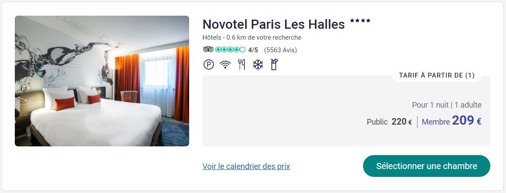

Test Technique Front
====================

## Consignes

#### Installation

Pour répondre à ce test, il est nécessaire d'avoir préalablement installé Node.js (10+) et Npm.

Cloner ce projet, puis lancer *npm install* pour installer le framework de test Jest.

#### Modalités

La rédaction de tests unitaires est fortement recommandée.

Lancer les tests unitaires avec *npm run test*.

Créer un tag git à chaque fin d'étape.

## Enoncé

*Les données présentes dans ce projet sont fictives, et ne représentent pas de réelles personnes ou de réels prix.*

On dispose de plusieurs sources de données, accessibles via des services:
- hotel-service: renvoie une liste d'hôtels dans Paris
- price-service: renvoie la liste des prix des chambres pour certains hôtels
- user-service: renvoie la liste des utilisateurs
- helper: classe utilitaire contenant une fonction de calcul de distance entre 2 points
- app: le code de l'application

### Etape n°1

Implémenter dans *app.js* la fonction *findHotelsNearby()* permettant de retourner la liste des hôtels dans un rayon de 2 km autour d'une position donnée. Vous pouvez librement ajouter du code aux services si besoin.

Inclure également dans le résultat la distance (nombre entier en mètres) entre la position et celle de l'hôtel.

*Exemple de structure de réponse attendue avec en entrée la position (48.856564, 2.351711):*
```json
[
 {
    "ridCode": "9685",
    "countryCode": "FR",
    "localRating": 4,
    "address": "20 Rue du Sommerard, 75005 PARIS",
    "commercialName": "Hôtel Mercure Paris Notre-Dame Saint-Germain-des-Prés",
    "distance": 84
  },
  ...
  {
    "ridCode": "1610",
    "countryCode": "FR",
    "localRating": 4,
    "address": "22  rue Danielle Casanova, 75002 PARIS",
    "commercialName": "Hôtel Stendhal Place Vendôme Paris - MGallery",
    "distance": 1966
  }
]
```

### Etape n°2

Implémenter dans *app.js* la fonction *findHotelNearbyWithBestOffer()* permettant de retourner l'hôtel proposant la chambre moins chère (ne prendre que les offres de type *STANDARD*) dans un rayon de 2 km autour d'une position donnée, pour une date donnée. En cas d'égalité sur le prix, retourner l'hôtel le plus proche. Vous pouvez librement ajouter du code aux services si besoin.

*Exemple de structure de réponse attendue:*
```json
{
  "ridCode": "A3C7",
  "countryCode": "FR",
  "localRating": 3.0,
  "address": "14 Rue Dagobert, 92110 CLICHY",
  "commercialName": "ibis Styles Paris Mairie de Clichy",
  "distance": 832,
  "offer": {
    "date": "11/01/2021",
    "fare": "STANDARD",
    "price": 60
  }  
}
```

### Etape n°3

Implémenter la partie html et css permettant de représenter visuellement une proposition d'hôtel, comme dans l'image ci-dessous. Seule la partie visuelle est demandée, il n'est pas nécessaire d'implémenter le comportement des boutons.

Il n'est pas nécessaire de reproduire exactement les couleurs et fonts, mais plutôt de se concentrer sur la disposition des éléments. Les images et logos nécessaires sont disponibles dans le répertoire *resources*.

Vous pouvez directement éditer les fichiers index.html et styles.css dans le projet.

Vous pouvez également ajouter un préprocesseur CSS (less, sass, stylus...) mais ne pas utiliser de lib tierce comme Bootstrap, Vuetify, Tailwind, etc.


